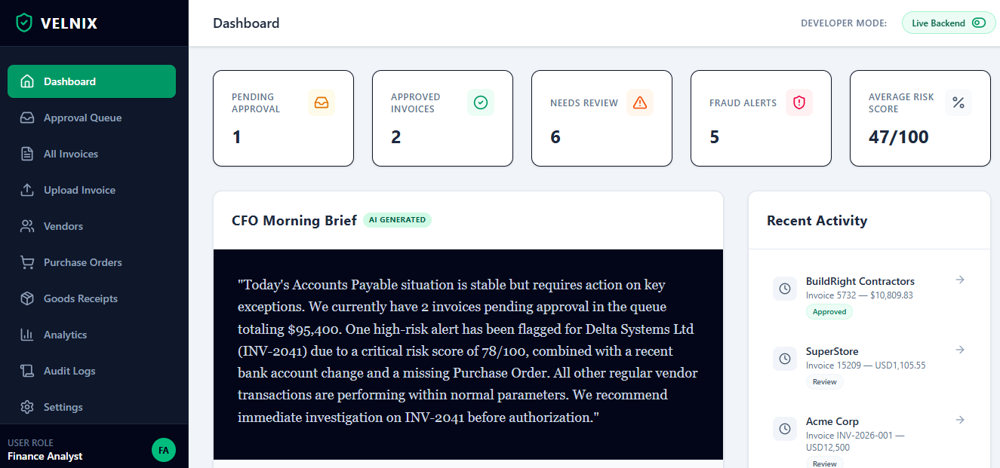
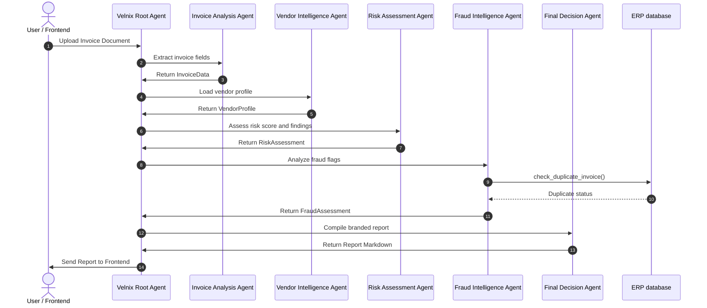
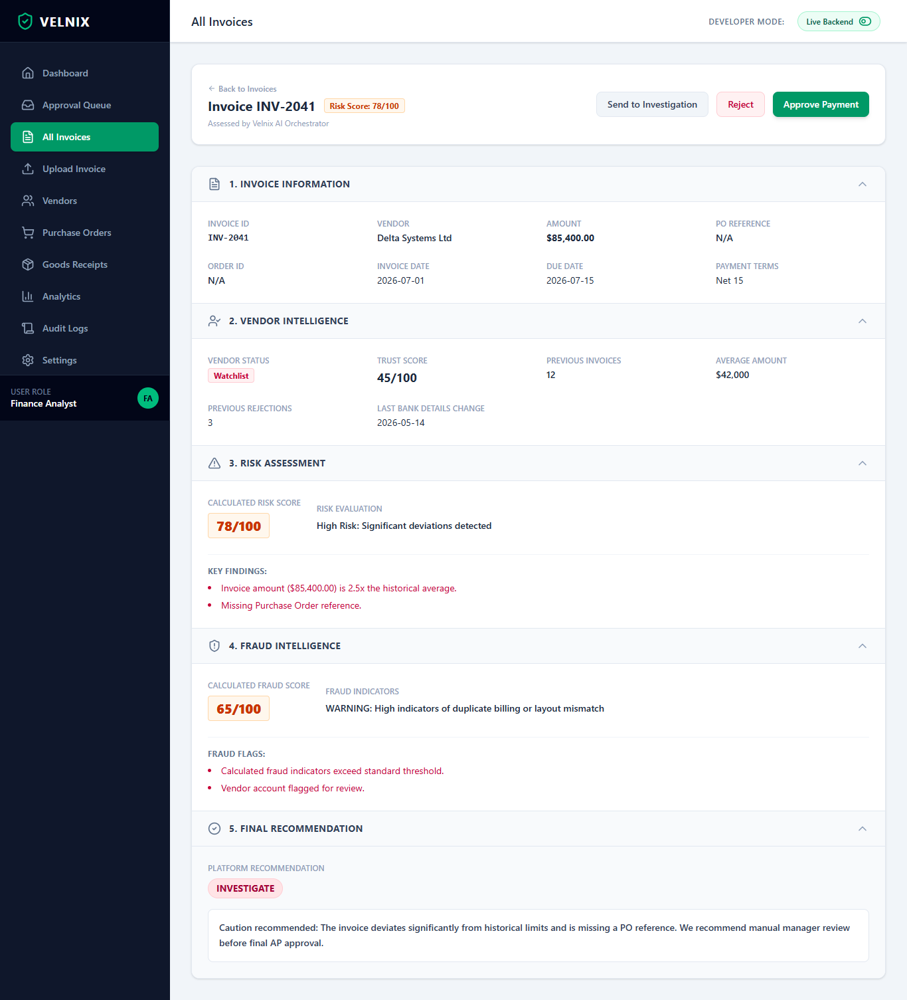
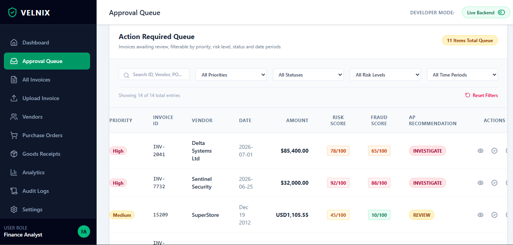
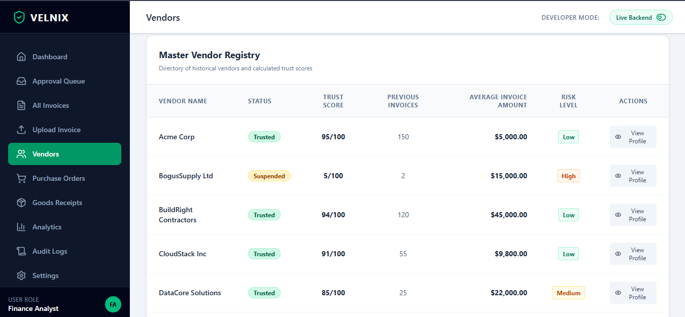

# VELNIX Finance Intelligence

**An AI-powered multi-agent invoice investigation platform that uses Google ADK and MCP to automate invoice extraction, vendor verification, risk assessment, fraud detection, and explainable payment recommendations using a mock ERP.** Velnix analyzes invoices to generate explainable investigation reports and payment recommendations for finance teams.

[](https://www.python.org/)
[](https://fastapi.tiangolo.com/)
[](https://react.dev/)
[](https://www.typescriptlang.org/)
[](https://github.com/google/adk)
[](https://deepmind.google/technologies/gemini/)
[](https://modelcontextprotocol.io/)
[](https://www.sqlite.org/)



---

## 📖 Overview

VELNIX is an AI-powered multi-agent invoice investigation platform that helps finance teams verify invoices before payment.

The system accepts PDF, image, and CSV invoices, extracts structured information using Gemini, verifies vendors against a mock ERP, performs deterministic risk and fraud assessments, and generates an explainable investigation report with payment recommendations.

The project demonstrates how Google ADK and MCP can be used to build modular AI agents that interact with structured enterprise-style data.

---

## ⚡ Quick Start

1.  **Clone the repository:**
    ```bash
    git clone <repository-url>
    cd velnix
    ```
2.  **Sync backend virtual environment:**
    ```bash
    uv sync
    ```
3.  **Install frontend dependencies:**
    ```bash
    cd frontend
    npm install
    cd ..
    ```
4.  **Configure environment:**
    Create a `.env` file from the example:
    ```bash
    cp .env.example .env
    ```
    And configure your `GEMINI_API_KEY`.
5.  **Run backend & frontend simultaneously:**
    ```bash
    agents-cli playground
    ```

---

## 🌟 Features

*   **Document Uploads:** Support for PDF invoices, image-based invoices (PNG/JPG/JPEG), and tabular CSV file uploads.
*   **AI Invoice Extraction:** AI-powered metadata extraction (amounts, currencies, due dates, PO numbers) from unstructured invoices.
*   **Vendor Verification:** Cross-references active invoices with historical records, trust scores, and onboarding status.
*   **Mock ERP Integration:** Built-in simulated database storing vendor master files, purchase order (PO) records, and goods receipts.
*   **Duplicate Invoice Detection:** Checks for invoice number duplication across active and historical payments.
*   **Risk Assessment:** Evaluates payment terms, high-value transaction thresholds, and watchlist indicators.
*   **Fraud Assessment:** Flags suspicious wording, sudden bank detail modifications, and extreme deviations from past pricing.
*   **Request-Scoped Canonical Context:** Preserves structured data across agent execution to prevent information loss during multi-agent orchestration.
*   **Explainable Investigation Reports:** Generates a structured markdown report compiling all findings and an actionable recommendation.
*   **Multi-Agent Orchestration:** Coordinated execution flow driven by Google ADK to process inputs and serialize steps.

---

## 📋 Problem Statement

Invoice verification in enterprise finance is labor-intensive, error-prone, and highly vulnerable to billing fraud. Auditors must manually cross-reference unstructured invoice details against vendor directories, purchase order histories, and goods receipt notes across siloed databases, making real-time prevention of duplicate payments or compliance violations extremely difficult. Traditional OCR extracts text but cannot easily combine document understanding with vendor history, duplicate checks, and business rules required for invoice investigation.

---

## 🧠 Why AI Agents?

Financial invoice investigation consists of multiple independent business tasks. Using specialized agents allows each task to be developed, tested, maintained, and extended independently while the Root Agent coordinates the overall workflow. Decomposing this workflow into independent business tasks allows each agent to focus on a single domain:
*   **Invoice Analysis:** Handles text parsing and field identification.
*   **Vendor Intelligence:** Manages database lookup and metric loading.
*   **Risk Assessment:** Evaluates payment guidelines and policy bounds.
*   **Fraud Assessment:** Looks for warning flags and duplicate invoices.
*   **Final Report Compilation:** Merges upstream facts into a unified display.

This modular separation of responsibilities improves the system's overall modifiability, explainability, maintainability, and ease of debugging.

---

## 🏛️ Architecture Overview

The platform follows a hierarchical multi-agent architecture built with Google ADK.

A Root Agent coordinates five specialized agents that execute sequentially. Each agent performs a single responsibility and communicates through structured tool outputs instead of relying on free-form natural language.

The platform combines LLM reasoning with deterministic Python business logic and a Mock ERP database exposed through MCP tools.

```text
                             ┌──────────────────────────┐
                             │          USER            │
                             └────────────┬─────────────┘
                                          │
                               Upload Invoice
                           (PDF / Image / CSV)
                                          │
                                          ▼
                        ┌────────────────────────────┐
                        │      React Frontend        │
                        └────────────┬───────────────┘
                                     │ REST API
                                     ▼
                        ┌────────────────────────────┐
                        │      FastAPI Backend       │
                        └────────────┬───────────────┘
                                     │
                                     ▼
                  ┌────────────────────────────────────┐
                  │   VELNIX Root Agent (Google ADK)   │
                  │ Coordinates the investigation flow │
                  └────────────┬───────────────────────┘
                               │
    ┌──────────────────────────┼───────────────────────────┐
    ▼                          ▼                           ▼
┌─────────────────┐      ┌──────────────────┐      ┌─────────────────┐
│ Invoice Analysis│      │ Vendor Intelligence│     │ Risk Assessment │
│      Agent      │      │       Agent       │      │      Agent      │
└────────┬────────┘      └─────────┬─────────┘      └────────┬────────┘
         │                         │                         │
         │                         │                         │
         │                 Vendor Lookup                     │
         │                         │                         │
         │                         ▼                         │
         │              ┌────────────────────┐              │
         │              │     MCP Server     │              │
         │              └─────────┬──────────┘              │
         │                        │                         │
         │                        ▼                         │
         │              ┌────────────────────┐              │
         │              │ Mock ERP (SQLite)  │              │
         │              │ Vendors / PO / GR  │              │
         │              └────────────────────┘              │
         │                                                  │
         └──────────────────────┬───────────────────────────┘
                                ▼
                     ┌────────────────────────┐
                     │ Fraud Intelligence     │
                     │        Agent           │
                     └──────────┬─────────────┘
                                │
                     Duplicate Invoice Check
                                │
                                ▼
                  ┌─────────────────────┐
                  │ Final Decision Agent│
                  └──────────┬──────────┘
                             │
                             ▼
             ┌────────────────────────────────┐
             │  VELNIX Investigation Report   │
             │                                │
             │ • Risk Score                   │
             │ • Fraud Score                  │
             │ • Findings                     │
             │ • Recommendation               │
             └──────────────┬─────────────────┘
                            │
                            ▼
    ┌──────────────────────────────────────────────────────┐
    │ APPROVE    │ REVIEW    │ INVESTIGATE    │ REJECT     │
    └──────────────────────────────────────────────────────┘
```

---

## 🏛️ System Architecture

Velnix is built on the **Google Agent Development Kit (ADK)**. ADK provides the orchestration loop, thread-local request contexts, structured tool bindings, and built-in telemetry logging.

The system integrates with a **Mock ERP database** via a Model Context Protocol (MCP) server, mapping SQL queries to secure agent tools.



### ERP Integration & Mock Data Policy
To ensure isolation, security, and developer ease:
*   The system uses a local **Mock ERP** database backed by SQLite (`app/erp/`).
*   It does **not** connect to a live production environment (e.g. SAP or Oracle).
*   The mock ERP uses simplified schemas inspired by common ERP concepts such as Vendor Master, Purchase Orders, and Goods Receipts.
*   This project serves as a demonstration of how AI agents interact with structured enterprise-style data in a safe, offline sandbox.

### MCP (Model Context Protocol) Integration
The Model Context Protocol (MCP) is utilized to safely expose our local mock ERP functions to the LLM. 
*   Instead of letting agents write arbitrary SQL queries, a local MCP server runs as a separate process or tool-wrapper.
*   The MCP toolset exposes specific Python functions (`get_vendor_profile`, `find_duplicate_invoice`, etc.) as tools.
*   The LLM invokes these tools via standardized MCP tool calls, providing a secure, sandboxed barrier between the AI reasoning loop and internal storage.

---

## 🤖 Multi-Agent Workflow

The pipeline sub-agents execute sequentially under the orchestration of the Root Agent:

| Agent Name | Mode | Responsibility | Key Tools |
| :--- | :--- | :--- | :--- |
| **Root Agent** | `Coordinator` | Orchestrates the investigation pipeline and coordinates all specialized agents. | ADK Orchestrator |
| **Invoice Analysis Agent** | `single_turn` | Parses raw document text and extracts invoice metadata. | `parse_invoice_tool` |
| **Vendor Intelligence Agent** | `single_turn` | Looks up the vendor name in the database and retrieves historical trust factors. | `get_vendor_profile_tool` |
| **Risk Assessment Agent** | `single_turn` | Compares invoice parameters against vendor profiles to compute risk scores. | `calculate_risk_tool` |
| **Fraud Intelligence Agent** | `single_turn` | Performs duplicate database checks and flags suspicious request context. | `find_duplicate_invoice`, `calculate_fraud_tool` |
| **Final Decision Agent** | `single_turn` | Formats and compiles the findings into the final presentation report. | `compile_report_tool` |

---

## 🛠️ Technology Stack

| Component | Technology | Version / Details |
| :--- | :--- | :--- |
| **Backend Framework** | FastAPI | Core REST API |
| **Agent Framework** | Google ADK | Orchestration and context management |
| **AI Models** | Google Gemini | `gemini-3.1-flash-lite` and `gemini-2.5-flash` |
| **Database** | SQLite (Mock ERP) | Serverless Mock ERP storage |
| **Integration Protocols** | Model Context Protocol (MCP) | Interface for Mock ERP tool access |
| **Frontend Framework** | React (Vite) | TypeScript SPA |
| **Package/Environment Manager** | Astral `uv` | Python dependencies and CLI management |
| **Document Parsing** | PyMuPDF | PDF extraction |
| **Testing** | pytest | Unit, consistency, and integration test suites |

---

## 📁 Project Structure

```
velnix/
├── app/                        # Backend Application
│   ├── app_utils/              # Helpers for setup, typing, telemetry
│   ├── erp/                    # Mock ERP business logic & SQLite schema
│   ├── mcp/                    # MCP server implementation & tool wrapper factories
│   ├── security/               # RBAC rules, audit logger, permission validation
│   ├── tools/                  # Deterministic calculation engines (risk, fraud)
│   ├── agent.py                # Multi-agent definitions, prompts, & orchestration
│   └── fast_api_app.py         # FastAPI backend server
├── frontend/                   # React + TypeScript frontend
│   ├── src/
│   │   ├── components/         # Reusable UI elements
│   │   ├── pages/              # Upload, dashboard, invoices, vendor details
│   │   └── services/           # Mock data and API layers
│   └── package.json
├── tests/                      # Unit and integration test suite
│   ├── unit/                   # Modular tests for engines and security
│   └── integration/            # Test suite for agent workflow and report consistency
├── GEMINI.md                   # Agentic development instructions
└── pyproject.toml              # UV-managed Python dependencies
```

---

## 💻 System Requirements

*   **OS:** Windows 10/11, macOS, or Linux.
*   **RAM:** Minimum 8GB (16GB recommended).
*   **Storage:** 500MB free space.

---

## 🚀 Detailed Installation & Setup

Follow these comprehensive steps to configure and boot the application from a clean clone.

### Prerequisites
1.  **Python 3.10+**: Ensure Python is installed and accessible. Check using:
    ```bash
    python --version
    ```
2.  **Node.js 18+** & **npm**: Check node version using:
    ```bash
    node --version
    ```
3.  **uv**: Install the Astral package manager to speed up setup:
    *   *macOS/Linux:* `curl -LsSf https://astral.sh/uv/install.sh | sh`
    *   *Windows (PowerShell):* `powershell -c "irm https://astral.sh/uv/install.ps1 | iex"`

### Installation Steps

1.  **Sync Backend Dependencies:**
    Run this command in the project root. It will create a `.venv` folder, resolve the lockfile, and install all required libraries (FastAPI, google-genai, etc.):
    ```bash
    uv sync
    ```
2.  **Install Frontend Node Modules:**
    Navigate to the React directory and install the packages:
    ```bash
    cd frontend
    npm install
    cd ..
    ```
3.  **Configure Environment Variables:**
    Duplicate the sample config file:
    ```bash
    cp .env.example .env
    ```
    Edit `.env` and set:
    *   `GEMINI_API_KEY`: Paste your Gemini API key (retrieve one from Google AI Studio).
    *   `VELNIX_USE_MOCK_MCP`: Set to `1` (enables the local database tools).

### Booting the Project

*   **Using Playground CLI (Recommended):**
    Run the playground. This launches both the FastAPI backend (port 8000) and Vite frontend (port 5173) in parallel:
    ```bash
    agents-cli playground
    ```
*   **Manual Boot (Separate Terminals):**
    *   *Terminal 1 (Backend):*
        ```bash
        uv run python -m uvicorn app.fast_api_app:app --host 0.0.0.0 --port 8000
        ```
    *   *Terminal 2 (Frontend):*
        ```bash
        cd frontend
        npm run dev
        ```

### Troubleshooting Common Issues
*   **Gemini API Key Missing:** If you get `APIKeyError` on invoice uploads, verify that `.env` is in the root directory (not `app/` or `frontend/`) and has no leading/trailing spaces around the key.
*   **Port 8000 Already in Use:** If FastAPI fails to bind, find the blocking process or run the app on a different port using `--port <number>` and update the frontend configuration under `frontend/src/services/api.ts`.

---

## 🧪 Running Tests

A comprehensive test suite verifies core logic and agent workflows.

*   **Run all tests:**
    ```bash
    uv run pytest
    ```
*   **Run only unit tests:**
    ```bash
    uv run pytest -v tests/unit/
    ```
*   **Run agent integration workflow tests:**
    ```bash
    uv run pytest -v tests/integration/test_agent.py
    ```

---

## 🔍 Example Investigation Flow

Below is an end-to-end execution of an invoice analysis run using the implemented components:

1.  **Invoice Extraction:** The user uploads an invoice. The `Invoice Analysis Agent` extracts the invoice fields using the Gemini model.
2.  **Vendor Lookup:** The `Vendor Intelligence Agent` calls the database tool to fetch historical vendor trust records.
3.  **Duplicate Check:** The `Fraud Intelligence Agent` invokes the duplicate invoice search tool to look for duplicate invoice numbers in the database.
4.  **Risk & Fraud Assessments:** The `Risk Assessment Agent` and `Fraud Intelligence Agent` run their respective analysis tools to calculate score outcomes and document warning indicators.
5.  **Executive Report Generation:** The `Final Decision Agent` aggregates the results and presents a styled **Velnix Investigation Report** markdown display.

---

## 📊 Results

The completed platform can:
*   Process PDF, image, and CSV invoices.
*   Extract structured invoice metadata using Gemini.
*   Verify vendors against a Mock ERP database.
*   Detect duplicate invoice submissions.
*   Perform deterministic risk and fraud assessments.
*   Generate explainable investigation reports.
*   Recommend APPROVE, REVIEW, INVESTIGATE, or REJECT actions.

Performance profiling and optimization reduced the end-to-end investigation pipeline from approximately 275 seconds to 210 seconds by eliminating duplicate agent execution and improving structured data propagation.

---

## 📸 Screenshots

*   **Home Dashboard:** 

*   **Investigation Report:** 

*   **Approval Queue:** 

*   **ERP Vendor Dashboard:**



---

## ⚙️ Engineering Challenges & Optimizations

### 1. The Duplicate Execution & Recovery Loop
During profiling, we discovered that `fraud_intelligence_agent` was running twice per request. We identified two separate bugs causing this:
*   **Casing Mismatch:** Upstream agents returned Pydantic-serialised camelCase schemas, whereas the `compile_report_tool` received LLM-reconstructed lowercase dictionary arguments. This casing mismatch caused the report compiler to see scores as `None`. The ADK orchestrator interpreted the missing output as an execution failure and triggered an automatic node recovery loop.
*   **RBAC Failure Loop:** The `fraud_intelligence_agent` was instructed to call `submit_investigation_result` automatically. Since analysis runs under the `Finance Analyst` role, this tool call raised an `AuthorizationError`. ADK automatically retried the failed agent node, resulting in redundant DB calls and duplicative Gemini API consumption.

#### The Solution: Request-Scoped Canonical Context
We extended the thread-local state storage pattern to cover risk and fraud assessments:
```python
# Caching the actual engine model outputs to the request scope
_request_ctx.risk_assessment = assessment.model_dump()
```
Now, `compile_report_tool` bypasses LLM-reconstructed dictionaries entirely and reads the canonical, authoritative assessment structs from the context. We also removed the automatic submission instruction from the agent prompt. The pipeline runtime dropped by **65 seconds per invoice analysis (~24%)** by executing each agent exactly once.

---

## 🚀 Future Improvements

*   **Three-Way Matching:** Programmatic validation checking that Invoice matches the Purchase Order (PO) AND the associated Goods Receipt (GR) notes.
*   **Line-Item Validation:** Automatic row-by-row quantity and unit price cross-referencing against contracted pricing terms.
*   **Bank Account Verification:** Integration with external banking API standards (e.g. IBAN check systems) to flag changed payment routing.
*   **Multi-Currency Support:** Historical exchange rate calculations for multi-currency vendor portfolios.
*   **Real ERP Connectors:** Connectors for production environments (e.g., SAP S/4HANA, Oracle NetSuite, and Microsoft Dynamics 365).
*   **ML-Based Anomaly Detection:** Continuous training on historical invoices to flag unusual billing volumes and frequency spikes.

---

## 📄 License

This project is licensed under the Apache 2.0 License. See the `LICENSE` file for details.
